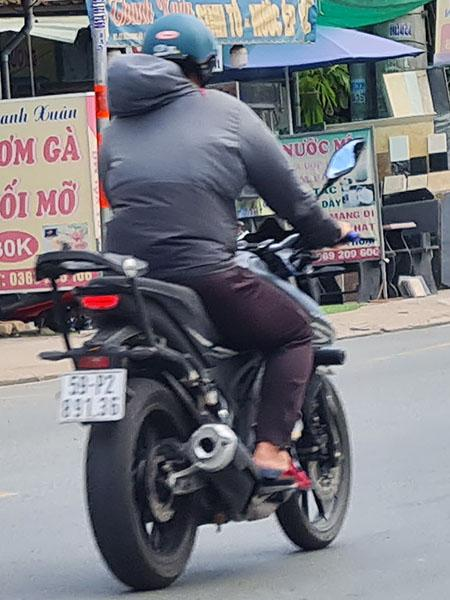

# Efficient-Real-Time-ALPR

<p align="center">
  
  <br>
  <em>Visual samples of challenging real-world license plates (motion blur, diverse layouts, low light) that Efficient-Real-Time-ALPR is built to handle.</em>
</p>

## 🧩 Pipeline
The framework is structured as a highly optimized two-stage sequential pipeline:

<p align="center">
   ➔ <b>YOLOv8n-Efficient</b> ➔  ➔ <b>SVTR26-Tiny</b> ➔ <code>59P289136</code>
</p>
<p align="center"><em>Overview of the proposed highly optimized two-stage ALPR pipeline.</em></p>

## 🏋️ Training & Evaluation

Efficient-Real-Time-ALPR provides a complete suite of scripts in the `tools/` directory for dataset preparation, training, evaluation, and inference.

### 0. Model Weights Preparation
Before training or evaluation, download the official pre-trained models from our [HuggingFace Repository](https://huggingface.co/anhone3/FastPlateOCR) and place them in the following structure:
```
Efficient-Real-Time-ALPR/
├── pretrained_models/
│   ├── yolov8n_efficient/
│   │   └── best.pt
│   └── svtr26_tiny/
│       └── best.pth
```
You can download them manually or use `wget`:
```bash
wget -O pretrained_models/det/yolov8n_efficient/best.pt https://huggingface.co/anhone3/FastPlateOCR/resolve/main/yolov8n_efficient/best.pt
wget -O pretrained_models/rec/svtr26_tiny/best.pth https://huggingface.co/anhone3/FastPlateOCR/resolve/main/svtr26_tiny/best.pth
```

### 1. Data Preparation (Create LMDB)
Because our LMDB script uses hardcoded paths for simplicity, please open `tools/create_lmdb_dataset.py` and modify the `data_dir` variable in the `__main__` block to match your dataset path before running:
```python
if __name__ == '__main__':
    data_dir = './dataset/rec' # Set your dataset directory

    label_file_list = [
        os.path.join(data_dir, 'train_labels.txt'),
        os.path.join(data_dir, 'val_labels.txt'),
        os.path.join(data_dir, 'test_labels.txt')
    ]
```
After modifying the paths, generate the LMDB:
```bash
python tools/create_lmdb_dataset.py
```

### 2. Training (Det & Rec)
Before training, you must configure the dataset paths, batch sizes, and learning rates in the respective `.yml` files.

**For Detection:**
Open `tools/train_det.py` and modify the parameters inside the `model.train()` function directly:
```python
model.train(
    data='dataset/det/data.yaml', # Point this to your YOLO data.yaml
    epochs=50,
    batch=256,
    ...
)
```

**For Recognition (`configs/rec/svtr26/svtr26_tiny.yml`):**
```yaml
Train:
  dataset:
    name: RatioDataSetTVResize
    data_dir_list: ['./dataset/rec/lmdb_data/train']

Eval:
  dataset:
    name: RatioDataSetTVResize
    data_dir_list: ['./dataset/rec/lmdb_data/val']
```

Once configured, start training:

> [!TIP]
> **Pre-trained Models (Fine-tuning)**
> By default, the training process will load pre-trained weights to speed up convergence. You can change this path or leave it empty (to train from scratch) by editing the `Global.pretrained_model` field inside the `.yml` config files:
> ```yaml
> Global:
>   pretrained_model: './pretrained_models/det/yolov8n_efficient/best.pt'
> ```

```bash
# Train Detection Model (YOLOv8)
python tools/train_det.py -c configs/det/yolov8/yolov8n_efficient.yml

# Train Recognition Model (SVTR26)
python tools/train_rec.py -c configs/rec/svtr26/svtr26_tiny.yml
```

### 3. Evaluation (Validation)
Evaluate your trained checkpoints on the validation set using the config files:
```bash
# Evaluate Detection (using default pretrained_model path from config)
python tools/eval_det.py -c configs/det/yolov8/yolov8n_efficient.yml

# Evaluate Recognition (using default pretrained_model path from config)
python tools/eval_rec.py -c configs/rec/svtr26/svtr26_tiny.yml
```

*(Optional)* You can also override the model path on-the-fly using the `-m` flag to evaluate your own newly trained weights:
```bash
# Evaluate Detection with a custom trained checkpoint
python tools/eval_det.py -c configs/det/yolov8/yolov8n_efficient.yml -m output/det/yolov8n_efficient/train/weights/best.pt

# Evaluate Recognition with a custom trained checkpoint
python tools/eval_rec.py -c configs/rec/svtr26/svtr26_tiny.yml -m output/rec/svtr26_tiny/train/best.pth
```

### 4. Batch Inference
Test your checkpoints directly on directories of images (supports `--save_log` to save predictions):
```bash
# Infer Detection
python tools/infer_det.py -m pretrained_models/det/yolov8n_efficient/best.pt -d dataset/det/test/images --save_log

# Infer Recognition
python tools/infer_rec.py -m pretrained_models/rec/svtr26_tiny/best.pth -d dataset/rec/test --save_log
```

## 🤝 Acknowledgements

- **OpenOCR**: Efficient-Real-Time-ALPR is built upon the robust foundation of [OpenOCR](https://github.com/Topdu/OpenOCR).
- **YOLOv8 & SVTRv2**: This work heavily leverages the architectural innovations from **YOLOv8** for high-speed object detection and **SVTRv2** for accurate text recognition.
  - Read the [YOLOv8 Paper](https://arxiv.org/html/2408.15857v1)
  - Read the [SVTRv2 Paper](https://arxiv.org/html/2411.15858v1)
- **Datasets**: Our evaluation utilizes datasets from [Brazil (RodoSol-ALPR)](https://github.com/raysonlaroca/rodosol-alpr-dataset), [China (CBLPRD-330k)](https://github.com/SunlifeV/CBLPRD-330k), and [Vietnam](https://www.kaggle.com/datasets/duydieunguyen/licenseplates) public collections alongside self-collected traffic footage. We sincerely thank the original authors of these datasets for advancing the ALPR research community.

## 📧 Contact
For any questions or issues, please open an issue or contact: `anhlone3@gmail.com`.
